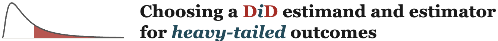

# DiD Estimands Companion Website

Interactive companion website for **Does TikTok Promote or Cannibalize Music Streaming? Estimands and Identification with Heavy-Tailed Outcomes** and its accompanying practitioner's guide.

**Visit the website:** https://didestimands.app

## Overview

This website provides an interactive environment for exploring Difference-in-Differences (DiD) estimands and estimators for heavy-tailed outcomes through visualizations, examples, and practical guidance.

## Screenshot

## Resources

- 🌐 **Interactive website:** [didestimands.app](https://didestimands.app)
- 📄 **Research paper:** [SSRN Paper](https://papers.ssrn.com/sol3/papers.cfm?abstract_id=6143552)
- 📘 **Practitioner's Guide Companion:** [SSRN Companion](https://papers.ssrn.com/sol3/papers.cfm?abstract_id=6813701)

## Citation

If you use this website, please cite:

> Winkler, Daniel, Christian Hotz-Behofsits, Nils Wlömert, Dominik Papies, and Jura Liaukonyte. *Does TikTok Promote or Cannibalize Music Streaming? Estimands and Identification with Heavy-Tailed Outcomes*. May 23, 2024. Cornell SC Johnson College of Business Research Paper. Practitioner’s Guide Companion: https://papers.ssrn.com/sol3/papers.cfm?abstract_id=6813701. Available at SSRN: https://ssrn.com/abstract=6143552 or http://dx.doi.org/10.2139/ssrn.6143552.
